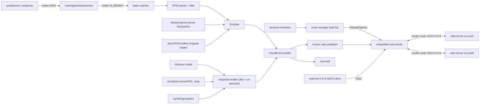

# Architecture

## One daemon per node, no broker

`proxmox-eventbus` runs on every PVE node as a hardened systemd service. Each
instance:

1. Watches `/var/log/pve/tasks/active` with inotify.
2. Enriches each UPID with VM/CT config from `/etc/pve` (pmxcfs).
3. Hands the resulting CloudEvent to an in-process publisher.
4. Publishes it onto an embedded NATS server, which forwards it to every
   other node's embedded NATS server over a TLS-encrypted route.

External consumers connect to one or more nodes; the NATS protocol gossips
the full topology so a single seed URL is enough after the first connect.

## Latency budget

For a `qm migrate` of an online VM:

| Stage | Typical | Worst-case |
|---|---|---|
| `qm migrate` -> UPID appears in `active` | < 1 ms | a few ms |
| inotify event -> our debounce timer fires | 25 ms | 50 ms |
| read `active`, parse UPID | < 1 ms | < 5 ms |
| read `/proc/<pid>/cmdline` for target | < 1 ms | < 5 ms |
| read `/etc/pve/qemu-server/<vmid>.conf` | < 1 ms | < 5 ms |
| build + JSON-encode CloudEvent | < 1 ms | < 5 ms |
| in-process NATS publish | < 100 us | < 1 ms |
| cluster route hop to peer node | ~RTT (LAN: < 1 ms) | depends |

End-to-end from "operator presses enter" to "consumer on a peer node receives
the event" is dominated by the 25 ms debounce window. We use a debounce
specifically because PVE rewrites `active` in-place and we don't want to chase
each byte; the timer can be lowered via config if your environment needs it.

## Why no JetStream in v1

Pure NATS Core (pub/sub) covers the floating-IP-style use cases at the
lowest possible latency. The only event class it can't guarantee is one whose
*originating* node crashed before publishing - on-node persistence wouldn't
have helped either. If you need replay or at-least-once delivery for
auditing, enable JetStream in a future release; it's a server option and
won't change the wire format.

## Advertise addresses

Both listeners default to `0.0.0.0` so the daemon is reachable from any
interface. nats-server gossips a "connect URL" to every client and peer
which they use to discover the rest of the cluster - if it gossips
`0.0.0.0` external clients can't use it, and the server logs
`Address "0.0.0.0" can not be resolved properly`.

To avoid that the daemon reads the local node IP from `/etc/pve/.members`
and sets it as both `ClientAdvertise` and `Cluster.Advertise`. This is the
same address other PVE cluster members use to reach this node, so it's the
correct one to gossip. Override per listener via `nats.client.advertise`
and `nats.cluster.advertise` if you need a different routable address
(e.g. a public hostname for external consumers).

## Why poll `.members` instead of inotify

`pmxcfs` rewrites the entire file atomically. The cost of a fresh `os.ReadFile`
is ~10 us off tmpfs, polling every 5 s is cheaper than maintaining an inotify
watch and reacting to noisy events.

## Failure modes

- Local NATS embedded server fails to start: the daemon exits with a clear
  error and systemd restarts it.
- pmxcfs not mounted yet: systemd ordering (`After=pve-cluster.service`)
  avoids this; the daemon will retry on startup anyway.
- Peer NATS unreachable: cluster routes back off and reconnect; client-side
  events are still delivered locally. Once the peer returns the route is
  re-established and subscription interest is gossipped back.
- Cert rotation (`pvecm updatecerts`): inotify on `/etc/pve/local/pve-ssl.*`
  triggers a hot reload of the tls.Config. Existing TLS sessions stay valid;
  new connections use the new cert.
